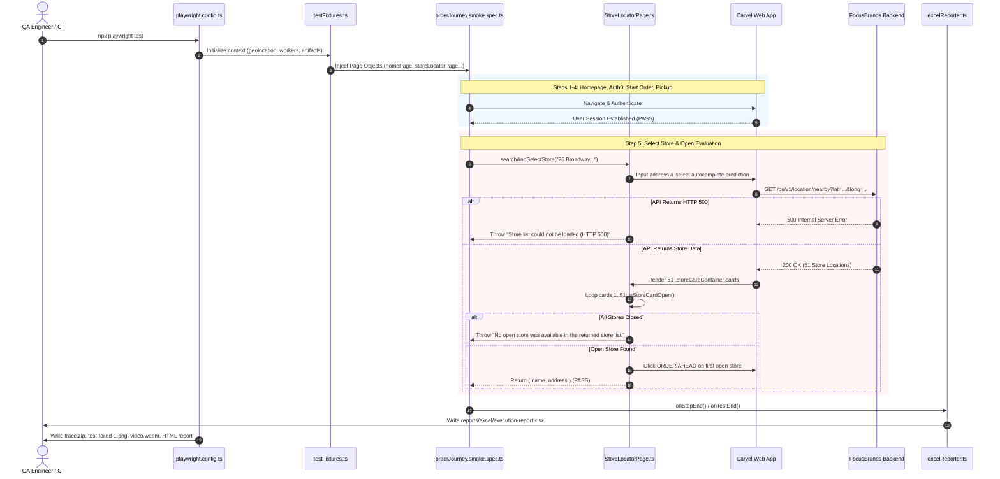

# Carvel Playwright + TypeScript Automation Framework: Comprehensive Learning Guide

---

## 1. Framework Architecture Overview

### 1.1 Technical vs. Simple Explanation

- **In Simple Terms**: Think of this test automation framework like a fully trained restaurant food inspector with a standard checklist. Instead of a human opening Chrome, typing carvel.com, logging in, picking an ice cream store, selecting a cake, and clicking checkout, a TypeScript script powered by Microsoft Playwright controls the browser automatically. Every check on the inspector's clipboard is an **assertion**. If a step succeeds, it is marked `PASS`. If a store cannot be selected or the backend crashes, it is marked `FAIL` with a clear explanation in an Excel sheet and a recorded video.
- **In Technical Terms**: This is an industrial-grade end-to-end (E2E) testing framework designed in **Playwright + TypeScript**, following the **Page Object Model (POM)** architectural pattern. It features **custom dependency injection fixtures**, **externalized JSON test datasets**, **isolated runtime environment secrets**, **centralized execution logging**, **custom ExcelJS reporter integration**, and **full multi-artifact diagnostic capture** (`trace: 'on'`, `screenshot: 'on'`, `video: 'on'`).

---

### 1.2 End-to-End Architectural Layer Diagram

```text
┌─────────────────────────────────────────────────────────────────────────────┐
│                             TEST INVOCATION                                 │
│                 npx playwright test tests/smoke/orderJourney.smoke.spec.ts  │
└──────────────────────────────────────┬──────────────────────────────────────┘
                                       │
                                       ▼
┌─────────────────────────────────────────────────────────────────────────────┐
│                          GLOBAL CONFIGURATION                               │
│  playwright.config.ts (Workers, Timeouts, Geolocation, Artifacts, Reporters)│
└──────────────────────────────────────┬──────────────────────────────────────┘
                                       │
                                       ▼
┌─────────────────────────────────────────────────────────────────────────────┐
│                         DEPENDENCY INJECTION                                │
│  fixtures/testFixtures.ts (Injects HomePage, LoginPage, StoreLocator, etc.) │
└──────────────────────────────────────┬──────────────────────────────────────┘
                                       │
                                       ▼
┌─────────────────────────────────────────────────────────────────────────────┐
│                         TEST SPECIFICATION (TC_001)                         │
│  tests/smoke/orderJourney.smoke.spec.ts                                     │
│  - testStoreData & testProductData (test-data/*.json)                       │
│  - getTestCredentials (.env via dotenv)                                     │
│  - test.step() Business Validation Boundaries                               │
└───────────────────┬─────────────────────────────────────┬───────────────────┘
                    │                                     │
                    ▼                                     ▼
┌──────────────────────────────────────┐  ┌───────────────────────────────────┐
│        PAGE OBJECT MODEL (POM)       │  │        CENTRALIZED LOGGING        │
│  pages/HomePage.ts                   │  │  utils/logger.ts                  │
│  pages/Header.ts                     │  │  - log_step()                     │
│  pages/LoginPage.ts                  │  │  - Zero raw console.log calls     │
│  pages/StoreLocatorPage.ts           │  └───────────────────────────────────┘
│  pages/OrderTypePage.ts              │
│  pages/PickupPage.ts                 │  ┌───────────────────────────────────┐
│  pages/MenuPage.ts                   │  │       EXTERNAL TEST DATA          │
│  pages/ProductListingPage.ts         │  │  test-data/stores.json            │
│  pages/ProductDetailPage.ts          │  │  test-data/users.json             │
│  pages/CartPage.ts                   │  │  test-data/products.json          │
│  pages/CheckoutPage.ts               │  └───────────────────────────────────┘
└───────────────────┬──────────────────┘
                    │
                    ▼
┌─────────────────────────────────────────────────────────────────────────────┐
│                         PLAYWRIGHT CORE ENGINE                              │
│  Chromium Browser Instance | CDP Protocol | Geolocation Context             │
└───────────────────┬─────────────────────────────────────────────────────────┘
                    │
                    ▼
┌─────────────────────────────────────────────────────────────────────────────┐
│                         TARGET APPLICATION UNDER TEST                       │
│  Carvel Next.js Web App (https://car.uat.focusbrands.com)                   │
│  ├── Truyo Consent System                                                   │
│  ├── Auth0 Identity Provider                                                │
│  └── Focus Brands Microservices (https://dev.focusbrands.com/ps/v1/...)     │
└───────────────────┬─────────────────────────────────────────────────────────┘
                    │
                    ▼
┌─────────────────────────────────────────────────────────────────────────────┐
│                         REPORTING & ARTIFACTS ENGINE                        │
│  ├── utils/excelReporter.ts  ──► reports/excel/execution-report.xlsx        │
│  ├── Playwright HTML Report  ──► playwright-report/index.html               │
│  ├── Action Tracing          ──► test-results/.../trace.zip                 │
│  ├── Failure Screenshots     ──► test-results/.../test-failed-1.png         │
│  └── Execution Video         ──► test-results/.../video.webm                │
└─────────────────────────────────────────────────────────────────────────────┘
```

---

### 1.3 Complete Execution Lifecycle

When you execute:
```bash
npx playwright test tests/smoke/orderJourney.smoke.spec.ts
```

1. **CLI Initialization**: Node.js executes `@playwright/test` runner.
2. **Config Evaluation**: Playwright loads [`playwright.config.ts`](file:///c:/QA%20PRP/Script/carvel-playwright/playwright.config.ts). `dotenv` reads secrets from `.env`. Playwright registers reporters (`html`, `list`, and [`utils/excelReporter.ts`](file:///c:/QA%20PRP/Script/carvel-playwright/utils/excelReporter.ts)).
3. **Worker Spawning**: Config sets `workers: 1`, ensuring a single dedicated worker process executes the smoke scenario without browser race conditions.
4. **Browser & Context Creation**: Playwright launches Chromium with browser context options:
   - Viewport: `1400 x 900`
   - Permissions: `['geolocation']`
   - Geolocation coordinates: `{ latitude: 40.7048, longitude: -74.0137 }`
   - Artifact capture: `trace: 'on'`, `screenshot: 'on'`, `video: 'on'`
5. **Fixture Instantiation**: [`fixtures/testFixtures.ts`](file:///c:/QA%20PRP/Script/carvel-playwright/fixtures/testFixtures.ts) instantiates the Page Object classes (`HomePage`, `Header`, `LoginPage`, `StoreLocatorPage`, etc.) using the freshly created `page` object.
6. **Test Spec Execution**: The test body in [`tests/smoke/orderJourney.smoke.spec.ts`](file:///c:/QA%20PRP/Script/carvel-playwright/tests/smoke/orderJourney.smoke.spec.ts) runs sequentially through 13 `test.step()` validation blocks.
7. **Reporter Hooks**:
   - `onStepEnd()`: Whenever a top-level `test.step()` completes, [`utils/excelReporter.ts`](file:///c:/QA%20PRP/Script/carvel-playwright/utils/excelReporter.ts) captures the step's expected assertion and initial status.
   - `onTestEnd()`: Merges step annotations from `recordStepActual()`.
   - `onEnd()`: Writes formatted data rows to [`reports/excel/execution-report.xlsx`](file:///c:/QA%20PRP/Script/carvel-playwright/reports/excel/execution-report.xlsx) and finalizes `playwright-report/index.html`.
8. **Teardown**: Playwright closes the browser context, compresses `trace.zip`, flushes `video.webm`, saves `test-failed-1.png`, and exits with code `0` (on pass) or `1` (on failure).

---

## 2. Directory Structure and Responsibilities

Every folder in this repository has a strict single responsibility:

```text
carvel-playwright/
├── fixtures/             # Dependency injection and test setup
├── pages/                # Page Object Model classes
├── reports/              # Custom Excel execution reports
│   └── excel/
├── test-data/            # Externalized JSON datasets
├── tests/                # Automated test specifications
│   └── smoke/
├── utils/                # Centralized helpers (logger, Excel reporter, data helper)
├── .env                  # Local secret credentials (git-ignored)
├── .env.example          # Sample environment template
├── .gitignore            # Git exclusion rules
├── package.json          # Node dependencies and npm scripts
├── playwright.config.ts  # Master test runner configuration
└── tsconfig.json         # TypeScript compiler configuration
```

### Detailed Breakdown of Folders

| Folder | Primary Purpose | What Belongs Here | What Does NOT Belong Here | How Used During Execution |
| :--- | :--- | :--- | :--- | :--- |
| **`fixtures/`** | Provide custom test fixtures & dependency injection | `testFixtures.ts`, custom fixtures, setup helpers | Page locators, test specs, credentials | Instantiates page objects and injects them into tests |
| **`pages/`** | House Page Object Model (POM) representations | `*Page.ts` classes with locators and page interactions | `test()`, `test.step()`, hardcoded credentials | Test calls page methods to interact with UI |
| **`tests/`** | Orchestrate business journeys and assertions | `.spec.ts` files, test suites | Direct DOM selectors, raw credentials | Executed by Playwright test runner |
| **`test-data/`** | Store environment-neutral test inputs | `users.json`, `stores.json`, `products.json` | Passwords, tokens, API keys, test code | Read by tests/page objects via `utils/testData.ts` |
| **`utils/`** | Framework-wide shared utilities | `logger.ts`, `excelReporter.ts`, `testData.ts` | Page-specific UI locators, test specs | Called by pages, tests, and Playwright reporter |
| **`reports/`** | Generated business reports | `reports/excel/execution-report.xlsx` | Raw test source code, node_modules | Written by `ExcelReporter` upon test completion |
| **`test-results/`** | Raw execution artifacts | `trace.zip`, `*.png`, `video.webm` | Source code | Output directory for diagnostic artifacts |
| **`playwright-report/`**| Playwright interactive HTML report | Static web assets, `index.html` | Source code | Generated by Playwright HTML reporter |

---

## 3. Deep Dive: Every Important File in the Framework

### 3.1 [`playwright.config.ts`](file:///c:/QA%20PRP/Script/carvel-playwright/playwright.config.ts)

- **What it is**: The master configuration blueprint for the entire Playwright test engine.
- **Why we need it**: Centralizes timeouts, reporters, browser settings, base URLs, and artifact policies without hardcoding them in test files.
- **Problem it solves**: Prevents scattered configurations; ensures uniform execution across local machines and CI/CD pipelines.
- **Real-World Analogy**: Like the building management system of a factory that dictates shift hours, security clearance, and safety gear for all workers.
- **Key Implementation Details**:
  ```typescript
  export default defineConfig({
    testDir: './tests',
    timeout: 180000,           // 3-minute global test timeout
    workers: 1,                // Single worker prevents store booking collisions
    reporter: [
      ['html', { open: 'never' }],
      ['list'],
      ['./utils/excelReporter.ts'],
    ],
    use: {
      baseURL: process.env.BASE_URL || 'https://car.uat.focusbrands.com',
      ignoreHTTPSErrors: true,
      trace: 'on',             // Captured for BOTH PASS and FAIL
      screenshot: 'on',        // Captured for BOTH PASS and FAIL
      video: 'on',             // Captured for BOTH PASS and FAIL
      permissions: ['geolocation'],
      geolocation: { latitude: 40.7048, longitude: -74.0137 },
    },
  });
  ```
- **Interview Questions**:
  - *Q: Why set `workers: 1` in an E2E commerce checkout suite?*
    **Answer**: To prevent concurrency conflicts where two tests attempt to log in with the same account or alter the same cart simultaneously.
  - *Q: Why configure `trace: 'on'` instead of `'retain-on-failure'`?*
    **Answer**: When validating new features or optimizing test speed, having trace records of passing runs allows analyzing exact network timings, cache behavior, and DOM state.

---

### 3.2 [`fixtures/testFixtures.ts`](file:///c:/QA%20PRP/Script/carvel-playwright/fixtures/testFixtures.ts)

- **What it is**: The dependency injection container that extends Playwright's base `test`.
- **Why we need it**: Automatically instantiates all 11 Page Objects and injects them as strongly-typed parameters into `test(...)`.
- **Problem it solves**: Eliminates repetitive boilerplate (`const homePage = new HomePage(page);`) inside tests.
- **Real-World Analogy**: Like an operating room nurse handing the surgeon the exact sterile instruments required as each surgical phase begins.
- **Key Code**:
  ```typescript
  type CustomFixtures = {
    homePage: HomePage;
    loginPage: LoginPage;
    header: Header;
    storeLocatorPage: StoreLocatorPage;
    orderTypePage: OrderTypePage;
    pickupPage: PickupPage;
    menuPage: MenuPage;
    productListingPage: ProductListingPage;
    productDetailPage: ProductDetailPage;
    cartPage: CartPage;
    checkoutPage: CheckoutPage;
  };

  export const test = base.extend<CustomFixtures>({
    homePage: async ({ page }, use) => {
      await use(new HomePage(page));
    },
    // ... all other page objects
  });

  export function recordStepActual(stepKeyword: string, actualValue: string): void {
    test.info().annotations.push({
      type: `excel-actual:${stepKeyword.toLowerCase()}`,
      description: actualValue,
    });
  }
  ```
- **Execution Flow**: Playwright reads the test signature, resolves the requested fixtures, runs setup before the test, yields control via `await use(...)`, and executes teardown after the test.

---

### 3.3 [`pages/StoreLocatorPage.ts`](file:///c:/QA%20PRP/Script/carvel-playwright/pages/StoreLocatorPage.ts)

- **What it is**: The Page Object representing `/store-search`. It handles address searching, Google Places autocomplete, store card parsing, and store open/closed inspection.
- **Why we need it**: Encapsulates all UI logic for store finding, separating UI locators from business test assertions.
- **Problem it solves**: Autocomplete dropdowns, cookie overlays, location prompts, and store availability logic are isolated in one maintainable file.
- **How it Works**:
  1. `performSearch(searchQuery)`:
     - Removes Truyo consent overlay via DOM evaluation (`document.getElementById('truyo-consent-module')?.remove()`).
     - Dismisses location permission prompts if visible.
     - Types address into `#store-search-input` and selects prediction (`[data-testid*="atom_address_list"]`).
     - Monitors `location/nearby` API HTTP status.
     - Throws a descriptive error if the API returns `HTTP 500`.
  2. `isStoreCardOpen(card)`:
     - Scans card text, badges, and buttons for `CLOSED`, `STORE CLOSED`, `closed`, `not open`.
     - Validates presence and enabled state of `ORDER AHEAD` / `ORDER NOW` / `START ORDER` button.
     - Returns `{ isOpen: boolean; reason: string }`.
  3. `selectFirstAvailableStoreOrderAhead(searchQuery)`:
     - Iterates through all cards sequentially.
     - Skips closed stores with logged reasoning.
     - Selects the first open store.
     - Throws `"No open store was available in the returned store list."` if all are closed.

---

### 3.4 [`pages/LoginPage.ts`](file:///c:/QA%20PRP/Script/carvel-playwright/pages/LoginPage.ts)

- **What it is**: Encapsulates authentication interactions across both the Carvel `/welcome` page and the external Auth0 authentication portal.
- **Why we need it**: Handles multi-origin authentication transitions and post-login hydration redirects.
- **Key Method**: `login(username, password)`:
  - Validates credentials are provided.
  - Clicks `SIGN IN` on `/welcome` and waits for URL transition to `auth0.com`.
  - Fills Auth0 username and password fields and submits.
  - Waits for redirect back to Carvel domain (`!url.includes('auth0.com')`).
  - Handles intermittent `"SOMETHING WENT WRONG"` recovery screens by clicking `TRY AGAIN`.
  - Asserts authenticated header profile link is visible.

---

### 3.5 [`pages/Header.ts`](file:///c:/QA%20PRP/Script/carvel-playwright/pages/Header.ts)

- **What it is**: Component object for the global application header.
- **Why we need it**: The header is present across all pages and provides primary navigation (`Start Order`, `Sign In`, `Cart`, `Menu`).
- **Resilience Feature**: Handles React element detachment during client-side hydration:
  ```typescript
  // Re-resolve #btn_startorder immediately before clicking to avoid React detachment
  const btn = this.page.locator('#btn_startorder').first();
  await btn.waitFor({ state: 'visible', timeout: 20000 });
  try {
    await btn.click({ timeout: 7000 });
  } catch {
    log_step('Start Order button detached during hydration re-render, retrying...');
    const freshBtn = this.page.locator('#btn_startorder').first();
    await freshBtn.click({ timeout: 15000 });
  }
  ```

---

### 3.6 [`pages/PickupPage.ts`](file:///c:/QA%20PRP/Script/carvel-playwright/pages/PickupPage.ts)

- **What it is**: Handles order scheduling modals (ASAP vs. Pickup Later).
- **Why we need it**: Carvel supports pickup date and time slots via custom React datepickers.
- **Key Implementation**:
  - `selectPickupLater()`: Selects future scheduling mode.
  - `selectDynamicDateAndTime()`: Dynamically picks the next available future day and valid time slot, avoiding hardcoded future dates that expire.
  - `confirmSchedule()`: Confirms schedule and returns `{ date, time }` for later verification in cart and checkout.

---

### 3.7 [`pages/CartPage.ts`](file:///c:/QA%20PRP/Script/carvel-playwright/pages/CartPage.ts) and [`pages/CheckoutPage.ts`](file:///c:/QA%20PRP/Script/carvel-playwright/pages/CheckoutPage.ts)

- **`CartPage.ts`**: Verifies store name, store address, scheduled date/time, product name, quantity, and price in the cart drawer before proceeding to checkout.
- **`CheckoutPage.ts`**: Verifies order review summary, locates saved payment cards, verifies `PLACE ORDER` button readiness, clicks `PLACE ORDER`, and extracts the final confirmation number and status.

---

### 3.8 [`utils/excelReporter.ts`](file:///c:/QA%20PRP/Script/carvel-playwright/utils/excelReporter.ts)

- **What it is**: A custom Playwright reporter using `exceljs` that compiles an Excel execution report containing assertion and validation results.
- **Why we need it**: Stakeholders and QA leads often require tabular spreadsheet reports with clear expected vs. actual outcomes rather than parsing raw CI terminal logs.
- **Key Features**:
  1. **Assertion-Only Filtering**:
     ```typescript
     if (step.category !== 'test.step' || (step.parent && step.parent.category === 'test.step')) {
       return;
     }
     ```
     Ensures low-level Playwright driver actions (`locator.click`, `page.goto`) are excluded, retaining only business validations.
  2. **ANSI Code Sanitization**:
     Strips terminal color codes from error messages:
     ```typescript
     const cleanError = rawError
       .replace(/\x1B\[[0-?]*[ -/]*[@-~]/g, '')
       .replace(/^Error:\s*/i, '')
       .split('\n')[0]
       .trim();
     ```
  3. **Worksheet Styling**: Applies blue header background (`#1F4E78`), zebra striping, green/red status formatting, text wrapping, and borders.

---

### 3.9 [`utils/logger.ts`](file:///c:/QA%20PRP/Script/carvel-playwright/utils/logger.ts)

- **What it is**: Centralized timestamped logging utility.
- **Why we need it**: Raw scattered `console.log()` calls clutter code, cannot be uniformly formatted, and violate clean code standards.
- **Key Implementation**:
  ```typescript
  export function log_step(message: string): void {
    const now = new Date();
    const timestamp = now.toISOString().replace('T', ' ').substring(0, 19);
    console.log(`[${timestamp}] [STEP] ${message}`);
  }
  ```

---

### 3.10 [`utils/testData.ts`](file:///c:/QA%20PRP/Script/carvel-playwright/utils/testData.ts)

- **What it is**: Data access layer bridging raw JSON files, environment variables, and the test spec.
- **Functions Provided**:
  - `getTestCredentials()`: Retrieves `TEST_USERNAME` and `TEST_PASSWORD` from `.env`.
  - `testStoreData`: Exports search query and location from [`test-data/stores.json`](file:///c:/QA%20PRP/Script/carvel-playwright/test-data/stores.json).
  - `testProductData`: Exports product name, category, size, and flavor from [`test-data/products.json`](file:///c:/QA%20PRP/Script/carvel-playwright/test-data/products.json).

---

## 4. Line-by-Line Breakdown: [`tests/smoke/orderJourney.smoke.spec.ts`](file:///c:/QA%20PRP/Script/carvel-playwright/tests/smoke/orderJourney.smoke.spec.ts)

Here is how the single end-to-end smoke test is constructed:

```typescript
// 1. Imports custom fixtures and utilities
import { test, expect, recordStepActual } from '../../fixtures/testFixtures';
import { testStoreData, testProductData, getTestCredentials } from '../../utils/testData';
import { log_step } from '../../utils/logger';

test.describe('Primary End-to-End Smoke Suite', () => {
  test('TC_001 – Pickup Later Order Journey', async ({
    homePage,
    header,
    loginPage,
    storeLocatorPage,
    orderTypePage,
    pickupPage,
    menuPage,
    productListingPage,
    productDetailPage,
    cartPage,
    checkoutPage,
    page,
  }) => {
    test.setTimeout(180000); // Sets maximum scenario duration to 3 minutes

    let selectedStore = { name: '', address: '' };
    let finalDate = '';
    let finalTime = '';
```

### Step 1: Open Homepage
```typescript
    await test.step('Open Homepage | Homepage title and header should be visible', async () => {
      log_step('Navigating to Carvel homepage');
      await homePage.navigate();
      await homePage.verifyPageLoaded();
      await expect(header.startOrderBtn).toBeVisible({ timeout: 15000 });
      recordStepActual('Homepage', 'Homepage loaded and verified');
      log_step('Homepage verified successfully');
    });
```
- **What it does**: Navigates to base URL, validates page title/URL, verifies header `START ORDER` button is ready.
- **Why written this way**: The title uses `Name | Expected Result` format. `excelReporter` splits on `|` to extract the assertion expectation.
- **If removed**: Subsequent steps fail immediately due to uninitialized session.

### Step 2: Authenticate User
```typescript
    await test.step('Authenticate User | User should be authenticated', async () => {
      log_step('Authenticating user session with .env credentials');
      const credentials = getTestCredentials();
      await header.clickSignIn();
      await loginPage.login(credentials.username, credentials.password);
      const authIndicator = page.locator('#link_auth_Profile, button#btn_startorder, a[href*="personal-info"]').first();
      await expect(authIndicator).toBeVisible({ timeout: 25000 });
      recordStepActual('Authenticate', 'User session authenticated successfully');
      log_step('User session authenticated successfully');
    });
```
- **What it does**: Retrieves secure credentials from `.env`, logs in via Auth0, and asserts authenticated profile indicator is visible.
- **If removed**: Cart checkout cannot use saved payment methods.

### Step 3 & 4: Start Order & Select Pickup
```typescript
    await test.step('Start Order | Start Order should be available and initiated', async () => {
      log_step('Initiating order from header');
      await header.clickStartOrder();
      recordStepActual('Start Order', 'Start Order initiated successfully');
      log_step('Start Order clicked successfully');
    });

    await test.step('Select Pickup | Pickup order type should be selected', async () => {
      log_step('Selecting Pickup order type');
      await orderTypePage.selectPickup();
      await expect(orderTypePage.pickupOption).toBeVisible({ timeout: 10000 });
      recordStepActual('Select Pickup', 'Pickup option selected successfully');
      log_step('Pickup order type selected');
    });
```
- **What it does**: Triggers the order flow modal and selects `Pickup`.

### Step 5: Select Store (With Open-Store & API Failure Detection)
```typescript
    await test.step('Select Store | First available open store should be selected', async () => {
      log_step(`Searching for store near: "${testStoreData.searchQuery}"`);
      try {
        selectedStore = await storeLocatorPage.searchAndSelectStore(testStoreData.searchQuery);
        expect(selectedStore.name).toBeTruthy();
        expect(selectedStore.address).toBeTruthy();
        await storeLocatorPage.verifyStoreSelected(selectedStore.name);
        recordStepActual('Select Store', `${selectedStore.name} - ${selectedStore.address}`);
        log_step(`Store selected: "${selectedStore.name}" (${selectedStore.address})`);
      } catch (err: any) {
        recordStepActual('Select Store', err?.message || 'Store selection failed');
        throw err;
      }
    });
```
- **What it does**: Searches `26 Broadway, New York, NY 10004`, inspects returned store cards for availability, selects the first open store, and records the outcome.
- **Error Handling**: If the API returns `HTTP 500` or no store is open, the error is recorded into the step annotation before re-throwing so the Excel report captures the business failure.

### Steps 6 to 13: Scheduling, Menu, Customization, Cart, Checkout
- **Select Pickup Later**: Chooses future pickup scheduling.
- **Select Date/Time**: Dynamically selects date and time slot.
- **Select Product**: Navigates to category and opens Product Detail Page (PDP).
- **Customize Product**: Selects radio buttons for size and flavor.
- **Add to Cart**: Adds item, verifies cart drawer, asserts scheduled slot matches.
- **Checkout**: Confirms saved card is selected and `PLACE ORDER` is enabled.
- **Place Order**: Submits the final order.
- **Verify Order Confirmation**: Validates confirmation number and status.

---

## 5. Page Object Model (POM) Explained

### 5.1 The Anti-Pattern (Bad Approach)

```typescript
// BAD: Everything piled into the test spec
test('order flow', async ({ page }) => {
  await page.goto('https://car.uat.focusbrands.com');
  await page.locator('#btn_startorder').click();
  await page.locator('#btn_pickup').click();
  await page.locator('#store-search-input').fill('26 Broadway');
  await page.locator('.storeSearchItem button').first().click();
  // If Carvel changes #btn_startorder to #start-order-btn,
  // 50 test files must be manually searched and edited!
});
```

### 5.2 The POM Pattern (Industrial Approach)

```typescript
// GOOD: Test describes the business flow, POM owns the UI locators
test('TC_001 – Pickup Later Order Journey', async ({ homePage, header, storeLocatorPage }) => {
  await homePage.navigate();
  await header.clickStartOrder();
  await storeLocatorPage.searchAndSelectStore('26 Broadway');
});
```

### 5.3 Maintainability Comparison

| Dimension | Bad Approach (Procedural) | Page Object Model (POM) |
| :--- | :--- | :--- |
| **Locator Changes** | Must update locators across dozens of spec files | Update locator in a single Page Object class |
| **Code Readability** | Cluttered with CSS selectors and sleep delays | Reads like executable business requirements |
| **Reusability** | Duplicate copy-pasted UI logic | Shared methods (`searchAndSelectStore`) called anywhere |
| **Separation of Concerns** | Actions, assertions, and selectors mixed together | Spec orchestrates, POM interacts, Test asserts |

---

## 6. Store Selection Logic & Failure Analysis

### 6.1 The Open-Store Inspection Algorithm

```text
Store Cards Rendered in DOM (.storeCardContainer)
                       │
                       ▼
            Count Total Cards (e.g., 51)
                       │
                       ▼
          Loop i = 0 to Total Cards - 1
                       │
                       ▼
             isStoreCardOpen(Card i)
         ┌─────────────┴─────────────┐
         ▼                           ▼
   Is Store Open?              Is Store Closed?
  (Button Enabled +             (Button Disabled /
   Open Text/Badge)             "CLOSED" / Text "Closed")
         │                           │
         │                           ▼
         │                 log_step("Store i closed; checking next")
         │                           │
         │                           ▼
         │                     i++ (Next Card)
         ▼
log_step("Store i open; selecting")
         │
         ▼
Click ORDER AHEAD button
         │
         ▼
Verify ordering UI loaded
         │
         ▼
Return { name, address }
```

### 6.2 Failure Classification: Understanding the Difference

| Failure Type | What It Means | Example in this Project |
| :--- | :--- | :--- |
| **Test Automation Failure** | Playwright script is flawed (bad selector, wrong wait) | Selecting a non-existent CSS class like `.fakeCard` |
| **UI Failure** | Frontend code broke (React crash, missing button) | Start Order button doesn't respond to click |
| **Backend / API Failure** | Server microservice failed (500, 502, 504) | `GET /ps/v1/location/nearby` returns `HTTP 500` |
| **Business / Data Failure** | System works, but data condition unmet | 51 stores returned, but all are closed for pickup |

### 6.3 Real-World Scenarios Observed in this Project

#### Scenario A: Backend API Failure (HTTP 500)
- **API Request**: `GET https://dev.focusbrands.com/ps/v1/location/nearby?lat=40.7048&long=-74.0137...`
- **Status**: `HTTP 500 Internal Server Error`
- **Result**: Zero `.storeCardContainer` elements rendered in DOM.
- **Framework Message**:
  `Store list could not be loaded because the nearby-location API returned HTTP 500. No store cards were rendered, so open-store selection could not be performed.`

#### Scenario B: Business Data Availability Failure (Current State)
- **API Request**: Successfully returns store list.
- **Result**: 51+ store cards rendered in DOM.
- **Execution**: The loop inspected cards 1 through 51. All 51 cards displayed disabled order buttons or explicit `Closed` badges.
- **Framework Message**:
  `No open store was available in the returned store list.`

> [!NOTE]
> This failure is **accurate and desirable**. Automation must never pick a closed store or bypass the API just to achieve a green checkmark. A green build that placed an order against a closed store would mask a production business defect.

---

## 7. Actions vs. Validations vs. Assertions

Understanding this distinction is critical for QA engineering:

```text
Action:      User or driver performs an operation
             (e.g., page.click('#btn_pickup'))

Validation:  Verification of an expected condition
             (e.g., verify that the pickup option is visibly selected)

Assertion:   The formal test verdict that passes or fails the execution
             (e.g., expect(orderTypePage.pickupOption).toBeVisible())
```

### Why Excel Reports Must Show Assertions, Not Actions

- **Poor Report**: Recording every `Click Button`, `Type Address`, `Click Suggestion`. The spreadsheet becomes 500 rows long and hides actual quality metrics.
- **Professional Report**: Recording each **Assertion / Expected Result** and its **Actual Result**. Stakeholders can immediately see:
  - Did the homepage load? `PASS`
  - Was the user authenticated? `PASS`
  - Was an open store selected? `FAIL` (`No open store was available in the returned store list.`)

---

## 8. Test Data vs. Environment Variables vs. Secrets

```text
┌───────────────────────┬───────────────────────┬───────────────────────┐
│       TEST DATA       │ ENVIRONMENT VARIABLES │        SECRETS        │
│   (test-data/*.json)  │      (.env / CI)      │      (.env / KMS)     │
├───────────────────────┼───────────────────────┼───────────────────────┤
│ Store search queries  │ BASE_URL              │ TEST_USERNAME         │
│ Product names         │ CI (true/false)       │ TEST_PASSWORD         │
│ Category names        │ HEADLESS (true/false) │ API Tokens            │
│ Flavor / Size choices │ Action timeouts       │ Payment credentials   │
│                       │                       │                       │
│ Safe to commit to Git │ Safe to commit sample │ NEVER commit to Git!  │
└───────────────────────┴───────────────────────┴───────────────────────┘
```

- **Rule**: Passwords and private credentials are kept in `.env`, which is listed in `.gitignore`.
- [`utils/testData.ts`](file:///c:/QA%20PRP/Script/carvel-playwright/utils/testData.ts) retrieves secrets via `process.env.TEST_USERNAME`.

---

## 9. Playwright Diagnostic Artifacts

The framework is configured to produce comprehensive diagnostics:

| Artifact | File Location | When Generated | How QA Engineers Use It |
| :--- | :--- | :--- | :--- |
| **Trace (`trace.zip`)** | `test-results/.../trace.zip` | Every run (PASS and FAIL) | Open with `npx playwright show-trace <path>`. Shows step-by-step DOM snapshots, console logs, network waterfalls, and action timings. |
| **Screenshot (`*.png`)** | `test-results/.../test-failed-1.png` | Every run (PASS and FAIL) | Visual capture of the browser viewport at the moment of completion or failure. |
| **Video (`video.webm`)** | `test-results/.../video.webm` | Every run (PASS and FAIL) | Full screen recording of the browser session from launch to teardown. |
| **HTML Report** | `playwright-report/index.html` | Every run | Interactive local web dashboard showing execution details, error call stacks, and embedded media. |
| **Excel Report** | `reports/excel/execution-report.xlsx` | Every run | Professional spreadsheet with test IDs, assertion descriptions, pass/fail statuses, and timestamps. |

---

## 10. Git Status and Tracked Changes

The current working tree reflects a clean repository state on branch `feature/complete-e2e-order-flow`:

### Staged Deletions (Legacy Duplicate Specs Cleaned Up)
- `tests/smoke/authentication.smoke.spec.ts` (removed; coverage consolidated into `TC_001`)
- `tests/smoke/navigation.smoke.spec.ts` (removed; coverage consolidated into `TC_001`)

### Modified Files (Core Framework Enhancements)
- [`playwright.config.ts`](file:///c:/QA%20PRP/Script/carvel-playwright/playwright.config.ts): Configured `trace: 'on'`, `screenshot: 'on'`, `video: 'on'`, `workers: 1`, and registered Excel reporter.
- [`fixtures/testFixtures.ts`](file:///c:/QA%20PRP/Script/carvel-playwright/fixtures/testFixtures.ts): Unified dependency injection and `recordStepActual()` step annotation helper.
- [`pages/StoreLocatorPage.ts`](file:///c:/QA%20PRP/Script/carvel-playwright/pages/StoreLocatorPage.ts): Added Truyo cookie removal, Google Places autocomplete selection, `isStoreCardOpen()` inspection, sequential open-store iteration, and `HTTP 500` API failure detection.
- [`tests/smoke/orderJourney.smoke.spec.ts`](file:///c:/QA%20PRP/Script/carvel-playwright/tests/smoke/orderJourney.smoke.spec.ts): Single end-to-end spec with 13 business validation steps.
- [`utils/excelReporter.ts`](file:///c:/QA%20PRP/Script/carvel-playwright/utils/excelReporter.ts): 6-column assertion-only reporting with ANSI code stripping.

### Ignored / Generated Directories
- `reports/excel/execution-report.xlsx`
- `test-results/`
- `playwright-report/`
- `.env`

---

## 11. Study Roadmap for Automation Engineers

### Must Know (Core Foundations)
- **TypeScript**: Interfaces, async/await, Promises, arrow functions, template literals.
- **Playwright Core**: `page.locator()`, `expect()`, `toBeVisible()`, auto-waiting vs. hardcoded timeouts.
- **Page Object Model**: Class constructors, locator encapsulation, action methods.
- **Test Fixtures**: Dependency injection pattern, fixture lifecycle.
- **Error Handling**: `try/catch/throw`, custom Error messages, locator debugging.

### Should Know (Intermediate Framework Architecture)
- **Network Monitoring**: `page.on('request')`, `page.on('response')`, capturing API status codes.
- **Custom Reporters**: Implementing the Playwright `Reporter` interface (`onStepEnd`, `onTestEnd`, `onEnd`).
- **Trace Viewer**: Analyzing DOM snapshots, network waterfalls, and action timelines.
- **Data Externalization**: Structuring JSON fixtures and environment-specific configs.
- **Headless Browser Nuances**: Geolocation permissions, cookie overlays, viewport rendering.

### Learn Later (Advanced Engineering)
- **Network Mocking / Interception**: `page.route()` for simulating 500 errors and edge cases.
- **CI/CD Integration**: GitHub Actions workflows, headless Docker container execution.
- **State Storage & Session Reuse**: `storageState` for bypassing repeated UI logins.
- **Multi-Tab / Multi-Origin Flows**: Handling cross-domain redirects (e.g. Auth0, payment gateways).

---

## 12. Interview Preparation Guide

### Basic Questions

#### Q1: What is the Page Object Model (POM) and why is it used?
- **Simple Answer**: It is a design pattern where each web page has its own code file containing its buttons and actions. The tests read like plain English without ugly selectors.
- **Technical Answer**: POM creates an abstraction layer between test specifications and UI implementation details. Page classes encapsulate element locators (`Locator`) and user interactions. If a UI selector changes, only the Page Object requires modification.
- **Example from this project**: In [`pages/StoreLocatorPage.ts`](file:///c:/QA%20PRP/Script/carvel-playwright/pages/StoreLocatorPage.ts), `#store-search-input` is encapsulated inside `this.searchInput`.

#### Q2: What is a Playwright fixture?
- **Simple Answer**: It is an automatic helper that sets up everything a test needs (like opening a page and logging in) before the test runs and cleans up when done.
- **Technical Answer**: Playwright fixtures provide modular dependency injection. Fixtures run on-demand, are scoped to the worker or test, handle setup and teardown via `await use()`, and inject typed instances into test arguments.
- **Example from this project**: In [`fixtures/testFixtures.ts`](file:///c:/QA%20PRP/Script/carvel-playwright/fixtures/testFixtures.ts), `storeLocatorPage` is injected directly into `TC_001`.

---

### Intermediate Questions

#### Q3: How do you handle dynamic store selection when some stores are closed?
- **Simple Answer**: Instead of blindly clicking the first store card, we count all cards, look at each one from top to bottom, check if it says "Closed" or has a disabled button, and pick the first one that is open. If all are closed, we fail with a clear message.
- **Technical Answer**: We locate all `.storeCardContainer` elements, iterate through the locator list using an index loop, inspect each card's DOM text, status badges, and action buttons (`button:has-text("CLOSED")` vs `button:has-text("ORDER AHEAD")`). We click the first card that satisfies the open criteria and throw a business error if no card meets the threshold.
- **Example from this project**: [`StoreLocatorPage.isStoreCardOpen()`](file:///c:/QA%20PRP/Script/carvel-playwright/pages/StoreLocatorPage.ts) evaluated 51 store cards and detected that all stores in UAT were closed.

#### Q4: How does Playwright's auto-waiting differ from Selenium?
- **Simple Answer**: Selenium makes you manually write `Thread.sleep()` or explicit waits everywhere. Playwright automatically checks if a button is visible, enabled, and stopped moving before clicking it.
- **Technical Answer**: Playwright performs automated actionability checks prior to executing actions like `.click()` or `.fill()`. It checks that the element is attached to the DOM, visible, stable (not animating), receives pointer events, and is enabled, eliminating the need for arbitrary `waitForTimeout()` calls.

---

### Advanced Questions

#### Q5: How do you distinguish between an automation defect, a frontend UI bug, and an API/backend failure?
- **Simple Answer**: We listen to the network requests in the background. If the server returned an error 500, it's a backend bug. If the server returned good data but the button didn't work, it's a frontend bug. If the app worked fine but our script looked for the wrong text, it's an automation bug.
- **Technical Answer**: By attaching network event listeners (`page.on('response')`) and inspecting HTTP status codes alongside DOM state. In our framework, when `dev.focusbrands.com/ps/v1/location/nearby` returned HTTP 500, the framework intercepted the 500 response and differentiated it from a locator timeout.

#### Q6: How do you report clean business assertions in an Excel report without cluttering it with browser clicks?
- **Simple Answer**: We filter out low-level actions in our custom reporter so that only major validation steps (with expected and actual results) are written to the spreadsheet.
- **Technical Answer**: In [`utils/excelReporter.ts`](file:///c:/QA%20PRP/Script/carvel-playwright/utils/excelReporter.ts), the `onStepEnd` hook checks `step.category === 'test.step'` and verifies `step.parent` is not another `test.step`. Low-level Playwright driver categories (`pw:api`, `expect`) are discarded. `test.step()` titles with format `Step | Expected Result` are parsed to populate the `Assertion / Expected Result` column.

---

## 13. End-to-End Execution Sequence Diagram


